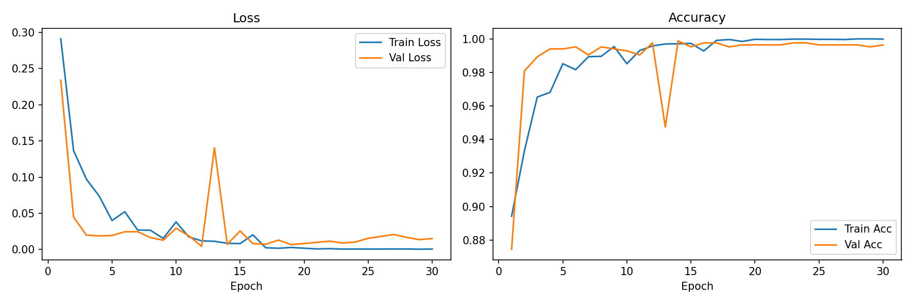
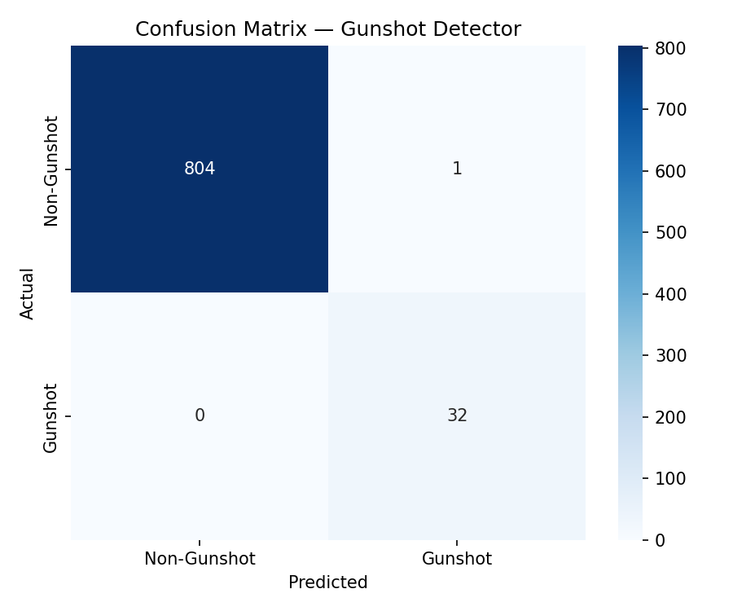
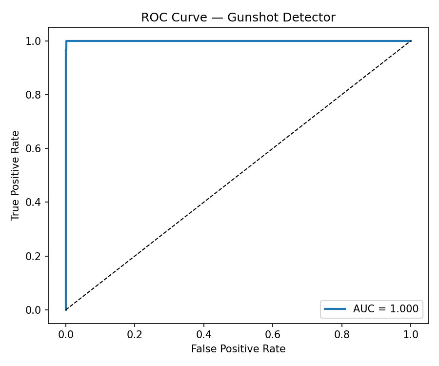

# GunshotCNN — Acoustic Threat Detection on Edge Hardware

A CNN trained from scratch on UrbanSound8K to classify gunshots against ambient urban sound. Built on a GTX 1050 laptop (4GB VRAM), which forced some concrete hardware-aware design decisions around memory, precision, and class imbalance. Inference was benchmarked against an Apple M4 for comparison.


---

## The Problem

Gunshot detection is one of the most time-critical tasks an acoustic surveillance system can perform. This project asks: how capable can a threat detector be when constrained to hardware that could realistically be deployed at the edge?

The answer: 99.88% accuracy, AUC 1.000, zero missed gunshots — using just 1,228MB of the 4GB VRAM available on an NVIDIA GTX 1050.

---

## Architecture

A custom CNN that treats audio as a visual problem. Raw audio is converted to a **mel-spectrogram** — a 2D image where the x-axis is time, the y-axis is frequency, and brightness encodes energy. The CNN then learns to recognize the distinctive visual signature of a gunshot: a sharp, broadband transient spike that looks nothing like ambient urban sound.

```
Input: (1, 64, 173) mel-spectrogram
    ↓
ConvBlock(1 → 32)   + MaxPool   # local frequency-time patterns
ConvBlock(32 → 64)  + MaxPool   # mid-level acoustic features  
ConvBlock(64 → 128) + MaxPool   # high-level threat signatures
ConvBlock(128 → 128)            # refinement
    ↓
AdaptiveAvgPool2d(4×4)
    ↓
FC(2048 → 256) → Dropout(0.3)
FC(256 → 64)   → Dropout(0.3)
FC(64 → 2)     → Softmax
    ↓
Output: [P(non-gunshot), P(gunshot)]
```

**Parameters:** 782,082  
**Why CNN and not LSTM/Transformer:** Spectrograms are images. CNNs find spatial patterns in images. Treating audio as a 2D representation is more sample-efficient and faster to train than raw sequence modeling.

---

## Hardware Constraint Engineering

This project was developed on an **NVIDIA GTX 1050 Mobile (4GB VRAM)** by deliberate choice. An Apple M4 MacBook was available throughout. The constraint was self-imposed to simulate edge deployment conditions and force hardware-aware design decisions.

| Decision | Choice | Reason |
|---|---|---|
| Architecture | Lightweight CNN | Fits in <2GB VRAM |
| Precision | AMP (FP16) | Reduces VRAM footprint during training |
| Input representation | Mel-spectrogram | Smaller than raw waveform, spatially structured |
| Optimizer | AdamW + Cosine LR | Fast convergence, less epochs needed |
| Class imbalance | Inverse-frequency weighting | Gunshots are 4.3% of dataset — weighting prevents the model ignoring them |

**Peak VRAM during training: 1,228MB out of 4,096MB (30% utilization)**  
This means the model could run on even more constrained edge hardware — e.g an embedded surveillance unit.

---

## Dataset

**UrbanSound8K** — 8,732 labeled urban sound clips across 10 classes.  
Binary relabeled: `gun_shot` (class 6) → positive, all others → negative.

| Split | Total | Gunshots | Non-Gunshots |
|---|---|---|---|
| Train (folds 1–9) | 7,895 | 342 (4.3%) | 7,553 |
| Test (fold 10) | 837 | 32 (3.8%) | 805 |

Class imbalance handled via inverse-frequency loss weighting (gunshot weight: 11.54×).

---

## Results

### Classification Report

```
              precision    recall  f1-score   support
 Non-Gunshot     1.0000    0.9988    0.9994       805
     Gunshot     0.9697    1.0000    0.9846        32
    accuracy                         0.9988       837
   macro avg     0.9848    0.9994    0.9920       837
weighted avg     0.9988    0.9988    0.9988       837

ROC-AUC: 1.0000
```

**0 missed gunshots. 1 false alarm out of 837 samples.**

The error profile is intentional — in a threat detection system, a missed gunshot (false negative) is far more dangerous than a false alarm (false positive). Recall of 1.000 on the threat class is the target metric.

### Training Curves


The spike at epoch ~13 is the cosine annealing scheduler temporarily increasing the learning rate — a known behavior that helps escape local minima before settling to a better optimum.

### Confusion Matrix


### ROC Curve


---

## Cross-Platform Inference Benchmark

The trained model was benchmarked on two fundamentally different hardware backends: CUDA on the GTX 1050 and Apple MPS on the M4 MacBook.

| Batch Size | CUDA / GTX 1050 (ms) | MPS / Apple M4 (ms) | Winner |
|---|---|---|---|
| 1  | 1.204 ± 0.207 | 1.723 ± 0.540 | CUDA |
| 8  | 3.795 ± 0.174 | 6.897 ± 2.602 | CUDA |
| 32 | 12.518 ± 0.160 | 13.224 ± 3.494 | CUDA |
| 64 | 27.634 ± 0.339 | 19.000 ± 1.609 | **MPS** |

**Finding:** CUDA wins at small batch sizes due to lower per-sample latency. MPS wins at large batch sizes — Apple's unified memory architecture scales better at high throughput. For real-time single-sample surveillance inference, CUDA on the GTX 1050 is the faster deployment target. For batch processing of recorded audio, the M4 becomes competitive.

The codebase automatically detects and adapts to available hardware — no manual configuration required when switching between machines.

---

## Usage

### Setup
```bash
git clone https://github.com/YOUR_USERNAME/gunshot-detector.git
cd gunshot-detector
pip install torch torchaudio librosa numpy pandas matplotlib seaborn scikit-learn tqdm

# CUDA (Windows/Linux):
pip install torch==2.1.0+cu118 torchaudio==2.1.0+cu118 --index-url https://download.pytorch.org/whl/cu118
```

### Preprocess Dataset
```bash
python src/dataset.py
```

### Train
```bash
python src/train.py
```

### Evaluate
```bash
python src/evaluate.py
```

### Single File Inference
```bash
python src/predict.py --file path/to/audio.wav
python src/predict.py --file path/to/audio.wav --threshold 0.7
```

### Benchmark Inference Latency
```bash
# On CUDA machine:
python benchmark/latency_test.py --device cuda

# On Apple Silicon Mac:
python benchmark/latency_test.py --device mps
```

---

## Limitations & Next Steps

- **Test set size:** Only 32 gunshot samples in fold 10. Results are strong but a larger held-out set would increase statistical confidence.
- **Dataset diversity:** UrbanSound8K gunshot clips are studio-recorded. Real-world gunshots vary significantly by distance, environment, and weapon type. Fine-tuning on in-the-wild recordings would be the next step.
- **With 8GB+ VRAM:** Would explore Physics-Informed Neural Networks or Neural ODEs for sequence modeling, and test whether a small Audio Spectrogram Transformer (AST) outperforms the CNN on this task.
- **Deployment:** The model is small enough (782K params) to export via ONNX or TorchScript for embedded deployment on a Jetson Nano or similar edge inference hardware.

---

## Project Structure

```
gunshot-detector/
├── config.py                   # All hyperparameters, auto device detection
├── src/
│   ├── dataset.py              # UrbanSound8K preprocessing + PyTorch Dataset
│   ├── model.py                # GunshotCNN architecture
│   ├── train.py                # Training loop with AMP + class weighting
│   ├── evaluate.py             # Confusion matrix, ROC curve, classification report
│   └── predict.py              # Single file inference
├── benchmark/
│   └── latency_test.py         # CUDA vs MPS inference latency benchmark
├── outputs/
│   ├── checkpoints/            # best_model.pth
│   └── plots/                  # Training curves, confusion matrix, ROC curve
└── README.md
```

---

## Hardware Used

| Component | Spec                             |
|---|----------------------------------|
| Training GPU | NVIDIA GTX 1050 Mobile, 4GB VRAM |
| Training OS | Windows 10                       |
| CUDA Version | 11.8                             |
| Inference (alt) | Apple M4, MPS backend            |
| PyTorch | 2.1.0                            |

---

*Trained from scratch. No pretrained weights or cloud GPUs were used.*
